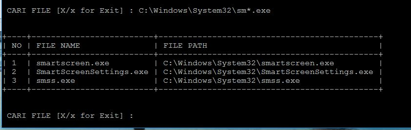

## Tentang Script
Script ini adalah perintah DIR /S /B pada command prompt yang disulap menjadi kreen 
dengan output yang bisa diatur menggunakan Python, outputnya berupa tabel

#HOW TO 
*	Install python 3 di windows, kemudian..
1.	Pertama, install module `terminaltables`, cara install module : buka `cmd.exe` sebagai `administratro`
	kemudian ketik perintah `pip install terminaltables` lalu ENTER, setelah selesai, script udah bisa dieksekusi
2.	buka `cmd.exe` dan lakukan `cd` ke direktori `script find.py` berada, setelah itu lanjutkan dengan ketik perintah di `cmd.exe` sebagai berikut : `python find.py`
3.	Hasil contoh screenshot dibawah : 
